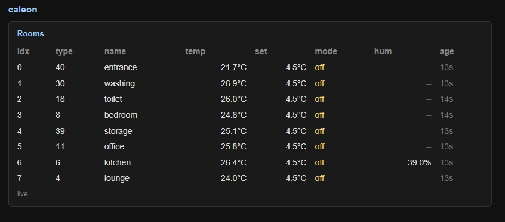
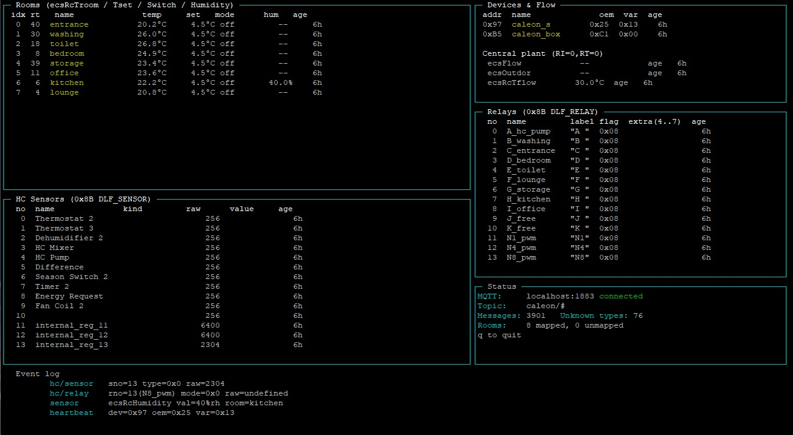

# caleon-canbus

Reverse-engineered MQTT bridge and live TUI/web UI for a Sorel/Caleon
hydronic heating install (CALEONbox + CALEON S room panel + 1-wire sensors)
reachable over CAN.

## Contents

- [Architecture](#architecture)
- [caleon2mqtt](#caleon2mqtt) — CAN → MQTT decoder (C, systemd)
- [caleon-web](#caleon-web) — minimal HTTP UI over MQTT (C, systemd)
- [caleon-tui](#caleon-tui) — console TUI over MQTT (Node.js)
- [Makefile](#makefile) — build, format, install
- [docs](#docs) — vendor PDFs

## Architecture

The CAN bus is bridged from the install site to wherever you want to consume
it, over IP, via [cannelloni](https://github.com/mguentner/cannelloni). On
top of the bridge sit the MQTT decoder ([caleon2mqtt](#caleon2mqtt)), the
HTTP UI ([caleon-web](#caleon-web)) and the console TUI
([caleon-tui](#caleon-tui)):

```
  [Heating bus]
       |
       | CAN @ 250 kbit/s
       v
  CANable2 USB adapter  (Bus 001 Device 004: 16d0:117e MCS CANable2,
       |                 firmware b158aa7 from github.com/normaldotcom/canable2.git)
       |
  ===== server (on-site box) =====
   slcand          /dev/ttyACM0  ->  can0           [slcand.service]
   cannelloni      can0  <->  UDP :20000            [cannelloni.service]
       |
       | UDP/IP over the LAN
       v
  ===== client (anywhere) =====
   vcan0           virtual CAN                      [vcan0.service]
   cannelloni      vcan0  <->  server:20000         [cannelloni.service]
       |
       v
   caleon2mqtt     vcan0  ->  caleon/* on mosquitto [caleon2mqtt.service]
       |
       +---> caleon-web    HTTP/SSE on :3002        [caleon-web.service]
       +---> caleon-tui    blessed console UI       (manual / screen / tmux)
       +---> Home Assistant, Node-RED, etc.         (whatever subscribes)
```

There are three logical hosts above — **server** (the box wired to the
CANable2), **client** (the box running `caleon2mqtt` + `caleon-web` against a
local mosquitto), and any **downstream consumer**. In a small install they
can all collapse onto one machine; the unit files don't care. The systemd
units that go with each role:

- `server/slcand.service` — `can0` from the CANable2 at 250 kbit/s
- `server/cannelloni.service` — exposes `can0` as UDP/20000
- `client/vcan0.service` — creates the virtual `vcan0`
- `client/cannelloni.service` — (via `cannelloni.sh`) resolves the server
  over mDNS and tunnels `vcan0` to it
- `caleon2mqtt.service` — runs the CAN→MQTT decoder against a local broker;
  installed by `make install` to `/etc/systemd/system/`
- `caleon-web.service` — runs the HTTP UI on `:3002`; also installed by
  `make install`

## caleon2mqtt

`caleon2mqtt.c` is a single-file C decoder (libmosquitto + libcjson) that
listens on `vcan0`, parses the SOREL SCBI program/function/message layout,
applies per-function scaling (decicelsius, decipercent, mode enum, ASCII
relay/PWM labels, sensor-absent sentinels) and publishes structured JSON on
`caleon/*` topics. With `--debug` it also prints the raw per-frame trace on
stdout — the same format the original `test.c` produced — so further protocol
reverse-engineering can continue.

- Build: `make caleon2mqtt` (needs `libmosquitto-dev` and `libcjson-dev`).
- Run:   `./caleon2mqtt -c caleon2mqtt.cfg [-i vcan0] [--debug]`.
- Config: `caleon2mqtt.cfg` (JSON) holds the broker settings plus the
  room/subscriber/relay/aux-function name tables — all installation-specific
  mapping lives there, not in code.
- Service: `caleon2mqtt.service` runs it as
  `caleon2mqtt -c /etc/default/caleon2mqtt` with auto-restart. `make install`
  drops the unit into `/etc/systemd/system/`; the installed config is at
  `/etc/default/caleon2mqtt` (see [Makefile](#makefile) for the host-specific
  override). Enable with `systemctl daemon-reload && systemctl enable --now
  caleon2mqtt`.

## caleon-web

`caleon-web.c` is a single-file C web app (libmosquitto + libcjson +
pthread, hand-rolled HTTP server, no other dependencies) that subscribes to
`caleon/sensor`, keeps an in-memory snapshot of every room it has seen, and
serves a small HTML page plus a Server-Sent Events stream so a connected
browser updates live. Each event carries per-field "seconds ago" so the UI
can show how stale a reading is and tick locally between updates. Only the
rooms panel is rendered today; more panels (relays, HC sensors, central
plant, devices) can be added the same way.



- Build: `make caleon-web`.
- Run:   `./caleon-web --mqtt localhost:1883 --port 3002 [--debug]`. With
  `--debug` every MQTT message, parse decision, HTTP request and SSE
  broadcast is logged to stderr.
- Service: `caleon-web.service` runs
  `caleon-web --mqtt localhost:1883 --port 3002` with auto-restart. `make
  install` drops the unit into `/etc/systemd/system/`. Enable with
  `systemctl daemon-reload && systemctl enable --now caleon-web`, then point
  a browser at `http://<host>:3002/`.

## caleon-tui

`caleon-tui.js` is a Node.js [blessed](https://github.com/chjj/blessed) console
TUI that subscribes to `caleon/#` and shows live rooms, central plant,
relays, HC sensors and an event log. It reads the same `caleon2mqtt.cfg` for
human-readable names. Same data, much richer than the web UI for now.



- Install: `npm install`.
- Run:     `node caleon-tui.js` (q or Ctrl-C to quit).

## Makefile

Targets are organised per service so you can install/restart/uninstall each
independently. The combined `install`, `restart`, `uninstall` just chain the
per-service ones. Following the `/opt/hostmon` pattern, the `install-*`
service targets stop + disable any previous unit, drop the new files in,
`daemon-reload`, then enable + start (safe when nothing is installed yet).

| target                          | what it does                                                              |
| ------------------------------- | ------------------------------------------------------------------------- |
| `make` / `all`                  | builds both `caleon2mqtt` and `caleon-web`                                |
| `make caleon2mqtt`              | just the decoder/bridge                                                   |
| `make caleon-web`               | just the web app                                                          |
| `make install`                  | both `install-caleon2mqtt` and `install-caleon-web`                       |
| `make install-caleon2mqtt`      | binary + config + service (stop/disable/install/reload/enable/start)      |
| `make install-caleon2mqtt-bin`  | just the `caleon2mqtt` binary, to `$(PREFIX)/bin` (default `/usr/local/bin`) |
| `make install-caleon2mqtt-cfg`  | just the config, to `/etc/default/caleon2mqtt` (host override applies)    |
| `make install-caleon2mqtt-service` | just the systemd unit                                                  |
| `make install-caleon-web`       | binary + service (no config file -- broker/port come in via CLI args)     |
| `make install-caleon-web-bin`   | just the `caleon-web` binary                                              |
| `make install-caleon-web-service` | just the systemd unit                                                   |
| `make restart`                  | restart both services                                                     |
| `make restart-caleon2mqtt`      | restart just `caleon2mqtt`                                                |
| `make restart-caleon-web`       | restart just `caleon-web`                                                 |
| `make uninstall`                | both `uninstall-caleon2mqtt` and `uninstall-caleon-web`                   |
| `make uninstall-caleon2mqtt`    | stop/disable, then remove binary, config and unit                         |
| `make uninstall-caleon-web`     | stop/disable, then remove binary and unit                                 |
| `make clean`                    | removes built binaries                                                    |
| `make format`                   | `clang-format -i` the C sources, `prettier --write` the JS                |

**Prove it from the console first, then turn it into a service.** Both
binaries log lifecycle and errors to stderr and have a `--debug` flag for
verbose traces, so the smooth path is:

1. Run `./caleon2mqtt -c caleon2mqtt.cfg --debug` in one screen/tmux pane and
   watch the per-frame decoder output. Once you see CAN frames being decoded
   and `mqtt: connected`, you know the bridge is alive.
2. Run `./caleon-web --mqtt localhost:1883 --port 3002 --debug` in another
   pane, open `http://<host>:3002/` and confirm rooms appear.
3. Optionally run `node caleon-tui.js` to cross-check against the TUI.
4. Once both have been running stably for a while, drop `--debug`, run
   `sudo make install` and `sudo systemctl enable --now caleon2mqtt
   caleon-web`. The services log to the journal (`journalctl -u
   caleon2mqtt -f` etc.).

**Host-specific config.** Following the same pattern as `/opt/hostmon`, if a
file named `caleon2mqtt.$(hostname).cfg` exists in the source directory,
`make install-cfg` installs *that* as `/etc/default/caleon2mqtt`; otherwise
it installs the repo's `caleon2mqtt.cfg`. The repo copy currently holds the
author's home install — drop in `caleon2mqtt.<yourhost>.cfg` to override
per-machine without disturbing it.

## docs

Vendor documentation kept under `docs/` for reference:

- `SOREL_CAN_bus_interface_rev11_COSTUMERS.pdf` — **primary protocol reference**
  (program/function/message layout, payload formats, scaling).
- `CBox_Documentation.pdf` — CALEONbox Anybus Modbus-TCP gateway manual; useful
  for the `0x95 ROOMDATA` definition.
- `Datenpunkte_Modbus_CBox_Clima.pdf` — Modbus register map / data-point list
  for the gateway (confirms decicelsius and decipercent scaling).
- `Cbox_Systemanleitung_en.pdf` — CALEONbox system / installer manual.
- `CALEONbox_en.pdf` — CALEONbox product datasheet.
- `70003d_CALEON_Smart_en.pdf` — CALEON Smart room-panel manual.
